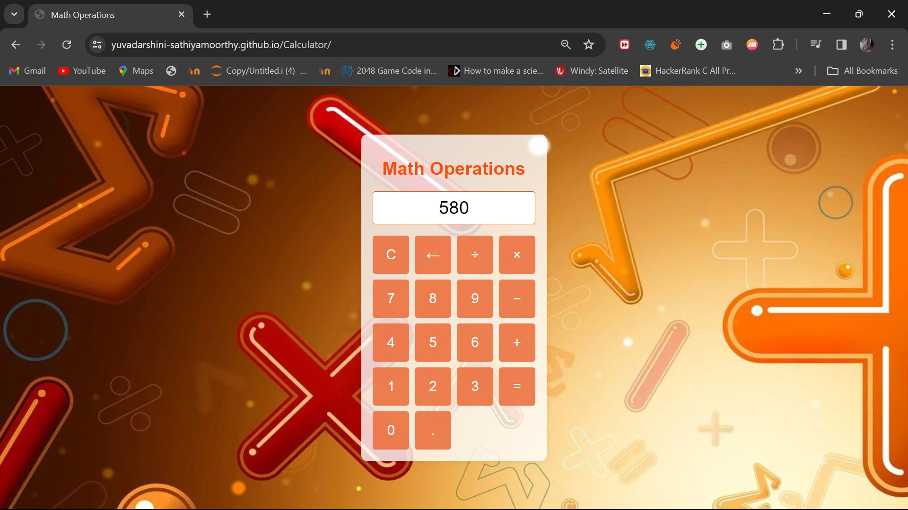

# Math Operations Webpage

## Aim
The aim of this project is to create a simple web application that allows users to perform basic mathematical operations using a custom number pad interface. The number pad and overall design are styled using various shades of pink to provide a visually appealing and cohesive look.

## Explanation
This project consists of three main components: HTML, CSS, and JavaScript. The HTML structure provides the layout of the number pad and display area. CSS is used to style the elements, giving the webpage its distinctive theme. JavaScript handles the functionality of the number pad, including appending numbers to the display, performing calculations, and clearing or deleting entries.

### Features
- **Number Pad**: A custom number pad allows users to input digits and mathematical operators.
- **Display**: A display area shows the current input and results of calculations.
- **Operations**: Users can perform addition, subtraction, multiplication, division, and handle decimal points.
- **Clear and Delete**: Users can clear the display or delete the last entry.

## Output

